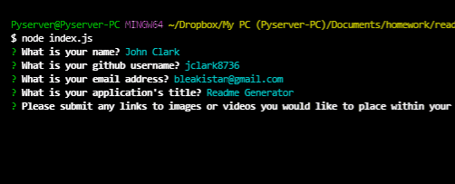

# Readme Generator;
  ## Objectives and Description:

  This application seeks to shorten the process of readme creation.

  The user runs the application, follows user prompts, and a readme is generated
  

  ## Technologies Used

  javascript,HTML,node.js,inquirer

  

  ## Installation Instructions
  To install, run npm i from the terminal.

  ## Usage Instructions
  To run, type node index.js from the terminal

  ## Credits
  

  ## Licenses
  MIT

  https://img.shields.io/badge/License-MIT-lightblue.svg

  ## Features
  

  ## How to contribute - please contact
  John Clark bleakistan@gmail.com (https://github.com/jclark8736)

  ## Testing

  To test, run npm -test from the terminal

